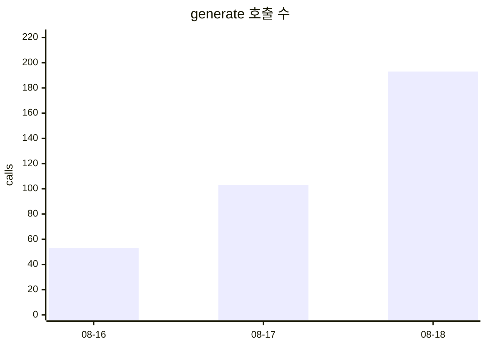
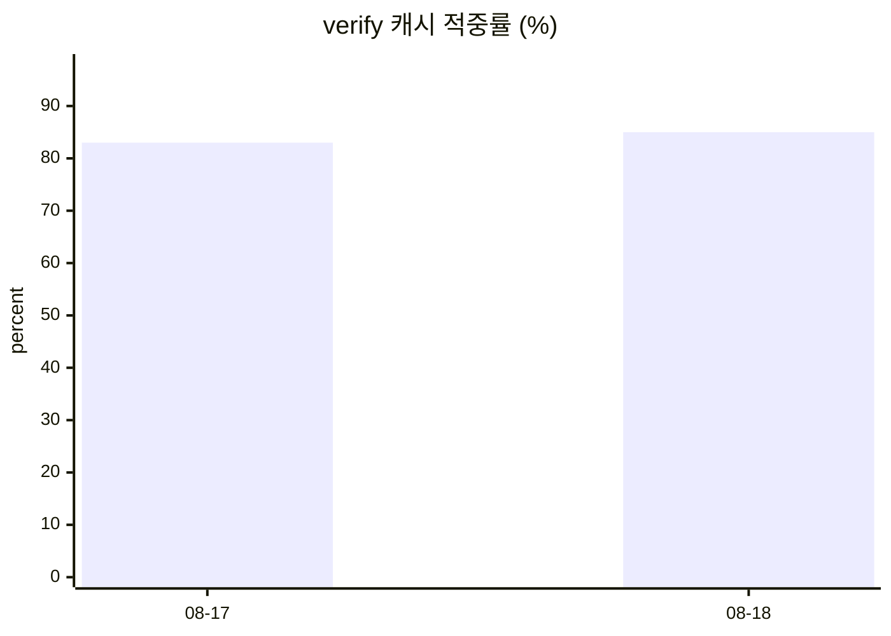

# 토큰 사용량

`GET /api/admin/audit/token-usage` 롤업을 그대로 옮긴 것이다. **원본은 `token_usage` 테이블**이고
이 파일은 사본이라 언제든 아래 명령으로 다시 만든다. 손으로 고치지 말 것.

```bash
~/bin/pinq-quiz-fetch.sh tokens 30 | python scripts/build-token-page.py -o docs/data/token-usage.md
```

## 날짜 x kind

| 날짜 | kind | 호출 | prompt | completion | cache_write | cache_read | total |
|---|---|---:|---:|---:|---:|---:|---:|
| 2026-08-16 ⚠️ | generate | 53 | 321,946 | 11,935 | 0 | 0 | 333,881 |
| 2026-08-16 ⚠️ | verify | 10 | 37,214 | 1,026 | 5,596 | 22,384 | 66,220 |
| 2026-08-17 | generate | 103 | 614,651 | 22,647 | 0 | 0 | 637,298 |
| 2026-08-17 | verify | 18 | 68,126 | 1,691 | 8,394 | 41,970 | 120,181 |
| 2026-08-18 | generate | 193 | 1,151,139 | 37,039 | 0 | 0 | 1,188,178 |
| 2026-08-18 | verify | 26 | 95,338 | 3,365 | 11,192 | 61,556 | 171,451 |

⚠️ 표시한 행은 **테이블 이전 구간**이다. `token_usage` 는 2026-08-17 배포부터 차므로 8/16 은
DB 에 없고 검수 로그의 수기 합계를 옮긴 것이다. 세는 법이 DB 행과 같은지는 보장되지 않는다.

## 캐시 성과

**적중률로 본다. `prompt` 합의 감소를 절감으로 읽지 않는다** — 캐시가 먹으면 당연히 줄어드는
값이라 그렇게 읽으면 캐시가 잘 들을수록 "비용이 늘었다"와 "줄었다"를 구분할 수 없다.

`generate` 는 캐시 대상이 아니라 제외했다(전부 `cache_write=0 cache_read=0`, 설계대로).
`회차 추정` 은 `cache_write / 2798` — 캐시 TTL 5분이라 회차마다 첫 건이 새로 쓴다.
정기·백필 회차 수와 맞는지 보는 자리다.

| 날짜 | verify 호출 | 캐시 적중 | 적중률 | cache_write | 회차 추정 |
|---|---:|---:|---:|---:|---:|
| 2026-08-16 ⚠️ | 10 | — | — | 5,596 | 2 |
| 2026-08-17 | 18 | 15 | 83% | 8,394 | 3 |
| 2026-08-18 | 26 | 22 | 85% | 11,192 | 4 |

## 추이



⚠️ 호출 수는 **낭비의 독립 지표가 아니다.** 그날 생성 시도 수와 함께 움직인다 —
손실 집계([loss-stats.html](loss-stats.html))의 시도 수와 나란히 볼 것.


