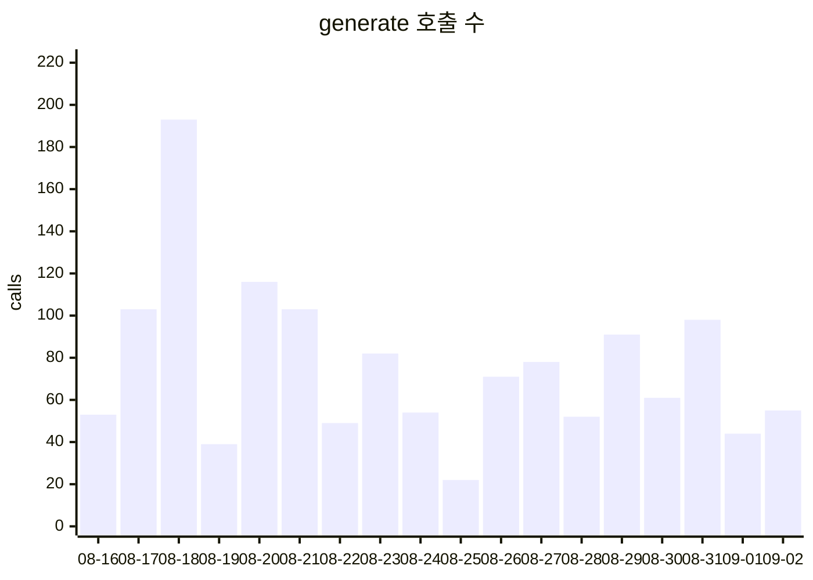
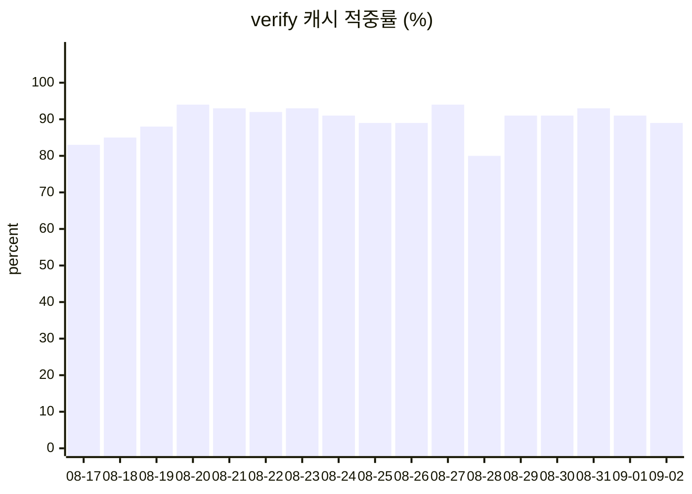

# 토큰 사용량

`GET /api/admin/audit/token-usage` 롤업을 그대로 옮긴 것이다. **원본은 `token_usage` 테이블**이고
이 파일은 사본이라 언제든 아래 명령으로 다시 만든다. 손으로 고치지 말 것.

```bash
~/bin/pinq-quiz-fetch.sh tokens 30 | python scripts/build-token-page.py -o docs/data/token-usage.md
```

## 날짜 x kind

| 날짜 | kind | 호출 | prompt | completion | cache_write | cache_read | total |
|---|---|---:|---:|---:|---:|---:|---:|
| 2026-08-16 ⚠️ | generate | 53 | 321,946 | 11,935 | 0 | 0 | 333,881 |
| 2026-08-16 ⚠️ | verify | 10 | 37,214 | 1,026 | 5,596 | 22,384 | 66,220 |
| 2026-08-17 | generate | 103 | 614,651 | 22,647 | 0 | 0 | 637,298 |
| 2026-08-17 | verify | 18 | 68,126 | 1,691 | 8,394 | 41,970 | 120,181 |
| 2026-08-18 | generate | 193 | 1,151,139 | 37,039 | 0 | 0 | 1,188,178 |
| 2026-08-18 | verify | 26 | 95,338 | 3,365 | 11,192 | 61,556 | 171,451 |
| 2026-08-19 | generate | 39 | 237,846 | 9,817 | 0 | 0 | 247,663 |
| 2026-08-19 | verify | 8 | 31,625 | 467 | 2,798 | 19,586 | 54,476 |
| 2026-08-20 | generate | 116 | 716,231 | 25,595 | 0 | 0 | 741,826 |
| 2026-08-20 | verify | 18 | 68,265 | 2,411 | 2,798 | 47,566 | 121,040 |
| 2026-08-21 | generate | 103 | 629,678 | 20,786 | 0 | 0 | 650,464 |
| 2026-08-21 | verify | 14 | 52,291 | 1,300 | 2,798 | 36,374 | 92,763 |
| 2026-08-22 | generate | 49 | 307,034 | 12,100 | 0 | 0 | 319,134 |
| 2026-08-22 | verify | 12 | 46,920 | 1,076 | 2,798 | 30,778 | 81,572 |
| 2026-08-23 | generate | 82 | 510,845 | 17,829 | 0 | 0 | 528,674 |
| 2026-08-23 | verify | 15 | 57,737 | 1,453 | 2,798 | 39,172 | 101,160 |
| 2026-08-24 | generate | 54 | 329,486 | 12,660 | 0 | 0 | 342,146 |
| 2026-08-24 | verify | 11 | 42,028 | 809 | 2,798 | 27,980 | 73,615 |
| 2026-08-25 | generate | 22 | 141,580 | 7,449 | 0 | 0 | 149,029 |
| 2026-08-25 | verify | 9 | 34,319 | 795 | 2,798 | 22,384 | 60,296 |
| 2026-08-26 | generate | 71 | 421,571 | 9,784 | 0 | 0 | 431,355 |
| 2026-08-26 | verify | 9 | 33,075 | 594 | 2,798 | 22,384 | 58,851 |
| 2026-08-27 | generate | 78 | 477,376 | 18,931 | 0 | 0 | 496,307 |
| 2026-08-27 | verify | 18 | 67,941 | 1,869 | 2,798 | 47,566 | 120,174 |
| 2026-08-28 | generate | 52 | 330,899 | 12,870 | 0 | 0 | 343,769 |
| 2026-08-28 | verify | 10 | 38,345 | 1,171 | 5,596 | 22,384 | 67,496 |
| 2026-08-29 | generate | 91 | 545,590 | 16,546 | 0 | 0 | 562,136 |
| 2026-08-29 | verify | 11 | 42,293 | 1,048 | 2,798 | 27,980 | 74,119 |
| 2026-08-30 | generate | 61 | 374,858 | 11,856 | 0 | 0 | 386,714 |
| 2026-08-30 | verify | 11 | 42,949 | 1,015 | 2,798 | 27,980 | 74,742 |
| 2026-08-31 | generate | 98 | 610,860 | 24,097 | 0 | 0 | 634,957 |
| 2026-08-31 | verify | 14 | 54,767 | 1,292 | 2,798 | 36,374 | 95,231 |
| 2026-09-01 | generate | 44 | 279,891 | 10,946 | 0 | 0 | 290,837 |
| 2026-09-01 | verify | 11 | 43,446 | 869 | 2,798 | 27,980 | 75,093 |
| 2026-09-02 | generate | 55 | 354,295 | 15,461 | 0 | 0 | 369,756 |
| 2026-09-02 | verify | 9 | 35,679 | 672 | 2,798 | 22,384 | 61,533 |

⚠️ 표시한 행은 **테이블 이전 구간**이다. `token_usage` 는 2026-08-17 배포부터 차므로 8/16 은
DB 에 없고 검수 로그의 수기 합계를 옮긴 것이다. 세는 법이 DB 행과 같은지는 보장되지 않는다.

## 캐시 성과

**적중률로 본다. `prompt` 합의 감소를 절감으로 읽지 않는다** — 캐시가 먹으면 당연히 줄어드는
값이라 그렇게 읽으면 캐시가 잘 들을수록 "비용이 늘었다"와 "줄었다"를 구분할 수 없다.

`generate` 는 캐시 대상이 아니라 제외했다(전부 `cache_write=0 cache_read=0`, 설계대로).
`회차 추정` 은 `cache_write / 2798` — 캐시 TTL 5분이라 회차마다 첫 건이 새로 쓴다.
정기·백필 회차 수와 맞는지 보는 자리다.

| 날짜 | verify 호출 | 캐시 적중 | 적중률 | cache_write | 회차 추정 |
|---|---:|---:|---:|---:|---:|
| 2026-08-16 ⚠️ | 10 | — | — | 5,596 | 2 |
| 2026-08-17 | 18 | 15 | 83% | 8,394 | 3 |
| 2026-08-18 | 26 | 22 | 85% | 11,192 | 4 |
| 2026-08-19 | 8 | 7 | 88% | 2,798 | 1 |
| 2026-08-20 | 18 | 17 | 94% | 2,798 | 1 |
| 2026-08-21 | 14 | 13 | 93% | 2,798 | 1 |
| 2026-08-22 | 12 | 11 | 92% | 2,798 | 1 |
| 2026-08-23 | 15 | 14 | 93% | 2,798 | 1 |
| 2026-08-24 | 11 | 10 | 91% | 2,798 | 1 |
| 2026-08-25 | 9 | 8 | 89% | 2,798 | 1 |
| 2026-08-26 | 9 | 8 | 89% | 2,798 | 1 |
| 2026-08-27 | 18 | 17 | 94% | 2,798 | 1 |
| 2026-08-28 | 10 | 8 | 80% | 5,596 | 2 |
| 2026-08-29 | 11 | 10 | 91% | 2,798 | 1 |
| 2026-08-30 | 11 | 10 | 91% | 2,798 | 1 |
| 2026-08-31 | 14 | 13 | 93% | 2,798 | 1 |
| 2026-09-01 | 11 | 10 | 91% | 2,798 | 1 |
| 2026-09-02 | 9 | 8 | 89% | 2,798 | 1 |

## 추이



⚠️ 호출 수는 **낭비의 독립 지표가 아니다.** 그날 생성 시도 수와 함께 움직인다 —
손실 집계([loss-stats.html](loss-stats.html))의 시도 수와 나란히 볼 것.


