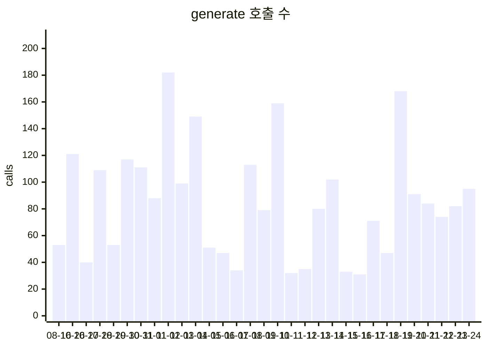
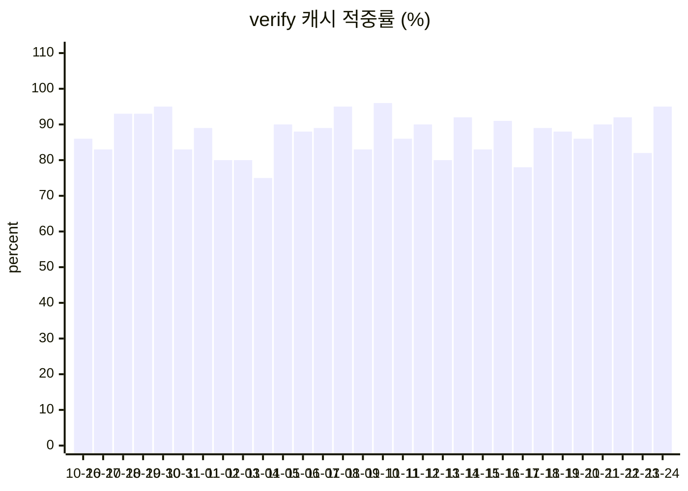

# 토큰 사용량

`GET /api/admin/audit/token-usage` 롤업을 그대로 옮긴 것이다. **원본은 `token_usage` 테이블**이고
이 파일은 사본이라 언제든 아래 명령으로 다시 만든다. 손으로 고치지 말 것.

```bash
~/bin/pinq-quiz-fetch.sh tokens 30 | python scripts/build-token-page.py -o docs/data/token-usage.md
```

## 날짜 x kind

| 날짜 | kind | 호출 | prompt | completion | cache_write | cache_read | total |
|---|---|---:|---:|---:|---:|---:|---:|
| 2026-08-16 ⚠️ | generate | 53 | 321,946 | 11,935 | 0 | 0 | 333,881 |
| 2026-08-16 ⚠️ | verify | 10 | 37,214 | 1,026 | 5,596 | 22,384 | 66,220 |
| 2026-10-26 | generate | 121 | 739,682 | 27,320 | 0 | 0 | 767,002 |
| 2026-10-26 | verify | 14 | 51,691 | 1,686 | 5,596 | 33,576 | 92,549 |
| 2026-10-27 | generate | 40 | 246,610 | 9,708 | 0 | 0 | 256,318 |
| 2026-10-27 | verify | 6 | 22,166 | 444 | 2,798 | 13,990 | 39,398 |
| 2026-10-28 | generate | 109 | 660,866 | 20,757 | 0 | 0 | 681,623 |
| 2026-10-28 | verify | 15 | 56,917 | 1,518 | 2,798 | 39,172 | 100,405 |
| 2026-10-29 | generate | 53 | 321,635 | 12,426 | 0 | 0 | 334,061 |
| 2026-10-29 | verify | 15 | 55,037 | 1,688 | 2,798 | 39,172 | 98,695 |
| 2026-10-30 | generate | 117 | 708,292 | 27,108 | 0 | 0 | 735,400 |
| 2026-10-30 | verify | 19 | 70,002 | 2,109 | 2,798 | 50,364 | 125,273 |
| 2026-10-31 | generate | 111 | 637,856 | 19,339 | 0 | 0 | 657,195 |
| 2026-10-31 | verify | 12 | 42,369 | 1,099 | 5,596 | 27,980 | 77,044 |
| 2026-11-01 | generate | 88 | 534,332 | 18,915 | 0 | 0 | 553,247 |
| 2026-11-01 | verify | 19 | 70,076 | 2,210 | 5,596 | 47,566 | 125,448 |
| 2026-11-02 | generate | 182 | 1,100,165 | 33,737 | 0 | 0 | 1,133,902 |
| 2026-11-02 | verify | 20 | 74,638 | 2,391 | 11,192 | 44,768 | 132,989 |
| 2026-11-03 | generate | 99 | 601,058 | 20,063 | 0 | 0 | 621,121 |
| 2026-11-03 | verify | 10 | 36,946 | 869 | 5,596 | 22,384 | 65,795 |
| 2026-11-04 | generate | 149 | 904,802 | 30,423 | 0 | 0 | 935,225 |
| 2026-11-04 | verify | 16 | 57,619 | 1,675 | 11,192 | 33,576 | 104,062 |
| 2026-11-05 | generate | 51 | 304,140 | 10,190 | 0 | 0 | 314,330 |
| 2026-11-05 | verify | 10 | 36,043 | 833 | 2,798 | 25,182 | 64,856 |
| 2026-11-06 | generate | 47 | 287,881 | 11,184 | 0 | 0 | 299,065 |
| 2026-11-06 | verify | 8 | 30,152 | 636 | 2,798 | 19,586 | 53,172 |
| 2026-11-07 | generate | 34 | 203,614 | 8,624 | 0 | 0 | 212,238 |
| 2026-11-07 | verify | 9 | 33,194 | 838 | 2,798 | 22,384 | 59,214 |
| 2026-11-08 | generate | 113 | 694,461 | 25,698 | 0 | 0 | 720,159 |
| 2026-11-08 | verify | 22 | 83,251 | 2,621 | 2,798 | 58,758 | 147,428 |
| 2026-11-09 | generate | 79 | 480,740 | 13,984 | 0 | 0 | 494,724 |
| 2026-11-09 | verify | 12 | 46,013 | 1,081 | 5,596 | 27,980 | 80,670 |
| 2026-11-10 | generate | 159 | 957,339 | 35,120 | 0 | 0 | 992,459 |
| 2026-11-10 | verify | 24 | 90,089 | 3,063 | 2,798 | 64,354 | 160,304 |
| 2026-11-11 | generate | 32 | 201,659 | 8,983 | 0 | 0 | 210,642 |
| 2026-11-11 | verify | 7 | 26,499 | 1,062 | 2,798 | 16,788 | 47,147 |
| 2026-11-12 | generate | 35 | 221,940 | 10,479 | 0 | 0 | 232,419 |
| 2026-11-12 | verify | 10 | 38,859 | 1,240 | 2,798 | 25,182 | 68,079 |
| 2026-11-13 | generate | 80 | 469,688 | 14,864 | 0 | 0 | 484,552 |
| 2026-11-13 | verify | 10 | 36,463 | 1,008 | 5,596 | 22,384 | 65,451 |
| 2026-11-14 | generate | 102 | 607,406 | 17,399 | 0 | 0 | 624,805 |
| 2026-11-14 | verify | 13 | 48,528 | 1,421 | 2,798 | 33,576 | 86,323 |
| 2026-11-15 | generate | 33 | 206,578 | 7,899 | 0 | 0 | 214,477 |
| 2026-11-15 | verify | 6 | 22,666 | 54 | 2,798 | 13,990 | 39,508 |
| 2026-11-16 | generate | 31 | 187,927 | 8,067 | 0 | 0 | 195,994 |
| 2026-11-16 | verify | 11 | 42,807 | 943 | 2,798 | 27,980 | 74,528 |
| 2026-11-17 | generate | 71 | 425,530 | 14,860 | 0 | 0 | 440,390 |
| 2026-11-17 | verify | 9 | 34,173 | 954 | 5,596 | 19,586 | 60,309 |
| 2026-11-18 | generate | 47 | 280,892 | 11,181 | 0 | 0 | 292,073 |
| 2026-11-18 | verify | 9 | 33,465 | 429 | 2,798 | 22,384 | 59,076 |
| 2026-11-19 | generate | 168 | 1,003,310 | 26,145 | 0 | 0 | 1,029,455 |
| 2026-11-19 | verify | 16 | 59,555 | 1,693 | 5,596 | 39,172 | 106,016 |
| 2026-11-20 | generate | 91 | 551,132 | 20,043 | 0 | 0 | 571,175 |
| 2026-11-20 | verify | 14 | 54,326 | 1,762 | 5,596 | 33,576 | 95,260 |
| 2026-11-21 | generate | 84 | 502,378 | 15,605 | 0 | 0 | 517,983 |
| 2026-11-21 | verify | 10 | 38,781 | 1,027 | 2,798 | 25,182 | 67,788 |
| 2026-11-22 | generate | 74 | 456,845 | 16,596 | 0 | 0 | 473,441 |
| 2026-11-22 | verify | 12 | 47,299 | 978 | 2,798 | 30,778 | 81,853 |
| 2026-11-23 | generate | 82 | 523,615 | 15,778 | 0 | 0 | 539,393 |
| 2026-11-23 | verify | 11 | 44,145 | 847 | 5,596 | 25,182 | 75,770 |
| 2026-11-24 | generate | 95 | 580,501 | 17,507 | 0 | 0 | 598,008 |
| 2026-11-24 | verify | 20 | 77,935 | 2,257 | 2,798 | 53,162 | 136,152 |

⚠️ 표시한 행은 **테이블 이전 구간**이다. `token_usage` 는 2026-08-17 배포부터 차므로 8/16 은
DB 에 없고 검수 로그의 수기 합계를 옮긴 것이다. 세는 법이 DB 행과 같은지는 보장되지 않는다.

## 캐시 성과

**적중률로 본다. `prompt` 합의 감소를 절감으로 읽지 않는다** — 캐시가 먹으면 당연히 줄어드는
값이라 그렇게 읽으면 캐시가 잘 들을수록 "비용이 늘었다"와 "줄었다"를 구분할 수 없다.

`generate` 는 캐시 대상이 아니라 제외했다(전부 `cache_write=0 cache_read=0`, 설계대로).
`회차 추정` 은 `cache_write / 2798` — 캐시 TTL 5분이라 회차마다 첫 건이 새로 쓴다.
정기·백필 회차 수와 맞는지 보는 자리다.

| 날짜 | verify 호출 | 캐시 적중 | 적중률 | cache_write | 회차 추정 |
|---|---:|---:|---:|---:|---:|
| 2026-08-16 ⚠️ | 10 | — | — | 5,596 | 2 |
| 2026-10-26 | 14 | 12 | 86% | 5,596 | 2 |
| 2026-10-27 | 6 | 5 | 83% | 2,798 | 1 |
| 2026-10-28 | 15 | 14 | 93% | 2,798 | 1 |
| 2026-10-29 | 15 | 14 | 93% | 2,798 | 1 |
| 2026-10-30 | 19 | 18 | 95% | 2,798 | 1 |
| 2026-10-31 | 12 | 10 | 83% | 5,596 | 2 |
| 2026-11-01 | 19 | 17 | 89% | 5,596 | 2 |
| 2026-11-02 | 20 | 16 | 80% | 11,192 | 4 |
| 2026-11-03 | 10 | 8 | 80% | 5,596 | 2 |
| 2026-11-04 | 16 | 12 | 75% | 11,192 | 4 |
| 2026-11-05 | 10 | 9 | 90% | 2,798 | 1 |
| 2026-11-06 | 8 | 7 | 88% | 2,798 | 1 |
| 2026-11-07 | 9 | 8 | 89% | 2,798 | 1 |
| 2026-11-08 | 22 | 21 | 95% | 2,798 | 1 |
| 2026-11-09 | 12 | 10 | 83% | 5,596 | 2 |
| 2026-11-10 | 24 | 23 | 96% | 2,798 | 1 |
| 2026-11-11 | 7 | 6 | 86% | 2,798 | 1 |
| 2026-11-12 | 10 | 9 | 90% | 2,798 | 1 |
| 2026-11-13 | 10 | 8 | 80% | 5,596 | 2 |
| 2026-11-14 | 13 | 12 | 92% | 2,798 | 1 |
| 2026-11-15 | 6 | 5 | 83% | 2,798 | 1 |
| 2026-11-16 | 11 | 10 | 91% | 2,798 | 1 |
| 2026-11-17 | 9 | 7 | 78% | 5,596 | 2 |
| 2026-11-18 | 9 | 8 | 89% | 2,798 | 1 |
| 2026-11-19 | 16 | 14 | 88% | 5,596 | 2 |
| 2026-11-20 | 14 | 12 | 86% | 5,596 | 2 |
| 2026-11-21 | 10 | 9 | 90% | 2,798 | 1 |
| 2026-11-22 | 12 | 11 | 92% | 2,798 | 1 |
| 2026-11-23 | 11 | 9 | 82% | 5,596 | 2 |
| 2026-11-24 | 20 | 19 | 95% | 2,798 | 1 |

## 추이


```mermaid
xychart-beta
    title "generate 호출 수"
    x-axis ["08-16", "10-26", "10-27", "10-28", "10-29", "10-30", "10-31", "11-01", "11-02", "11-03", "11-04", "11-05", "11-06", "11-07", "11-08", "11-09", "11-10", "11-11", "11-12", "11-13", "11-14", "11-15", "11-16", "11-17", "11-18", "11-19", "11-20", "11-21", "11-22", "11-23", "11-24"]
    y-axis "calls" 0 --> 210
    bar [53, 121, 40, 109, 53, 117, 111, 88, 182, 99, 149, 51, 47, 34, 113, 79, 159, 32, 35, 80, 102, 33, 31, 71, 47, 168, 91, 84, 74, 82, 95]
```

⚠️ 호출 수는 **낭비의 독립 지표가 아니다.** 그날 생성 시도 수와 함께 움직인다 —
손실 집계([loss-stats.html](loss-stats.html))의 시도 수와 나란히 볼 것.


```mermaid
xychart-beta
    title "verify 캐시 적중률 (%)"
    x-axis ["10-26", "10-27", "10-28", "10-29", "10-30", "10-31", "11-01", "11-02", "11-03", "11-04", "11-05", "11-06", "11-07", "11-08", "11-09", "11-10", "11-11", "11-12", "11-13", "11-14", "11-15", "11-16", "11-17", "11-18", "11-19", "11-20", "11-21", "11-22", "11-23", "11-24"]
    y-axis "percent" 0 --> 111
    bar [86, 83, 93, 93, 95, 83, 89, 80, 80, 75, 90, 88, 89, 95, 83, 96, 86, 90, 80, 92, 83, 91, 78, 89, 88, 86, 90, 92, 82, 95]
```
